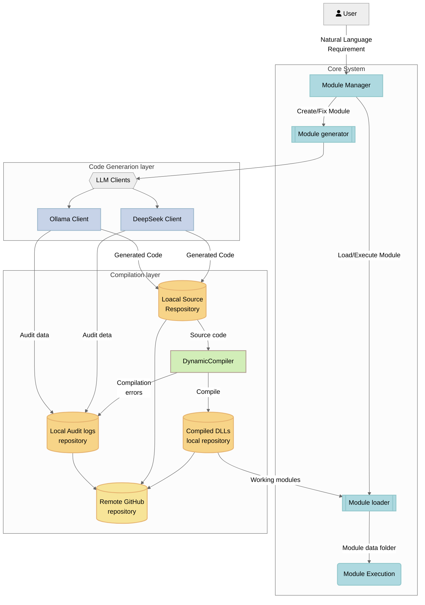

# Self-Evolving Software Through AI-Generated Modules: A Novel Approach to Dynamic Feature Expansion

**NOTE** This document is a work in progress

## Abstract

### Context ###
Traditional software development requires extensive manual effort for implementing new features, fixing bugs, and evolving applications over time. Each update cycle involves planning, coding, testing, documenting and deployment, often leading to delays that can impact software performance and user experience. Moreover, as applications grow in complexity, maintaining and expanding their functionality becomes increasingly resource-intensive. Addressing these challenges demands an innovative approach that enhances adaptability and reduces reliance on human intervention for software evolution.
### Contribution ###
This document presents a novel self-evolving software system that autonomously extends its capabilities through AI-generated modules. By leveraging large language models (LLMs), the system can dynamically generate, validate, and integrate new features with minimal human oversight. the system also can review the existing features to generate upgrades and optimizations. This approach streamlines the software development lifecycle, enabling rapid iteration and adaptation to changing user needs or system requirements.
### Key Results ###
- **Successful Model Integration:** The system effectively combines cloud-based and local LLM models to generate functional code snippets and modular enhancements.
- **High Compilation Success Rate:** The AI-generated modules achieve a first-attempt compilation success rate of 91.98%, demonstrating reliability in code generation. 
- **High Creation Success Rate:** The 99.7% of the AI-generated modules were created successfully without human intervention after providing the requiriment description.
- **Automated Version Control & Auditing:** The system seamlessly integrates with GitHub, enabling version-controlled updates and maintaining comprehensive audit trails to track modifications and ensure accountability.

### Implications ###

The proposed self-evolving software paradigm represents a significant shift in software engineering, paving the way for highly adaptive and autonomous systems. By reducing the dependency on manual coding for feature expansion, this approach enhances development efficiency, accelerates innovation cycles, and minimizes downtime caused by lengthy update processes. Additionally, AI-assisted development introduces new opportunities for optimizing software maintenance, making applications more resilient to evolving technological and business demands.

## Introduction
### Problem Space
Modern software applications often rely on static architectures that require manual intervention for updates, feature enhancements, and bug fixes. This rigidity creates several challenges:

- **Limited Adaptability:** Traditional software lacks the ability to evolve dynamically, requiring human developers to manually implement changes.
- **Developer Bottlenecks:** The increasing complexity of applications has widened the gap between user demands and developer throughput, leading to longer development cycles and delayed feature releases.
- **Operational Disruptions:** Updating software often involves downtime, regression risks, and resource-intensive testing, impacting overall system efficiency and user experience.
- **Costs to the final user:** The adition of new features, optimizations, bug fixes and fine tunning of existing softwares usually means a extra cost to the final users.

As user needs evolve rapidly, there is a pressing demand for a more adaptive and autonomous approach to software development that can dynamically respond to changes without requiring continuous human intervention with a low cost in time and money.

### Proposed Solution
To address these limitations, I'm introducing a self-evolving software framework that autonomously generates and integrates new functionality based on natural language requests. This system leverages a multi-model AI architecture, combining cloud-based and local inference models to optimize performance, privacy, and resource efficiency.

- **Autonomous Module Generation:** The system uses AI to interpret user-defined natural language requirements, translating them into functional software modules that seamlessly integrate into the existing application.
- **Hybrid AI Deployment:** A multi-model approach balances the power of cloud-based models for complex reasoning with the privacy and control of locally hosted models, ensuring adaptability without compromising security.

By enabling software to evolve independently, this approach minimizes developer workload, accelerates feature deployment, and enhances overall system resilience.

### Key Innovations
This self-evolving software framework incorporates several groundbreaking innovations:

- **Roslyn-Based Dynamic Compilation Pipeline:** Utilizes the Roslyn compiler to enable real-time code generation, validation, and execution within a controlled environment.
- **Self-Healing Mechanism via Error Feedback Loops:** AI-driven error detection and iterative refinement processes ensure robustness by continuously improving module performance.
- **Self-Upgrading Capability** Proactive identification of potential enhancements, optimizations, or new feature opportunities through continuous self analysis.
- **Version-Aware Module Loading System:** Automatically manages different versions of generated modules, maintaining backward compatibility and ensuring smooth integration with existing functionalities.
- **Self-Documenting Capability** A contunue self analisys allows the system to automatically document the implemented features and any other change in the source code.

By combining these innovations, the proposed system introduces a paradigm shift in software engineering, allowing applications to autonomously expand their capabilities, self-optimize, and reduce dependence on manual development cycles.

## Architectural Overview
### Core Components

### Workflow

    Natural Language → LLM Prompt Engineering

    Requirement Analisys → Detailed feature requirements 

    Code Generation → Interface Implementation

    Compilation → Roslyn Dynamic Assembly

    Documentation → Markdown documents

    Version Control → Git Integration

    Runtime Loading → Reflection-based Activation

## Technical Implementation
### LLM Integration

- Prompt engineering specifications for code generation:
    
    Implement IGeneratedModule interface with:
        
        - File I/O container  
        - No external dependencies if possible
        - Error handling
        - The response must be in the specified format
        - List required APIs
        - List Required NuGets

- Multiple-model fallback strategy, uses reasoning models in case of errors or complex tasks

### Dynamic Compilation

- Roslyn compiler API integration
    - Include all base .NET 9.0 C-Sharp libraries
    - Include Self-Evolving software core libraries
    - Support multiple source code files and structures
    - Support for NuGets
- Compiled modules resolution
    - Sync compiled modules local repository with remote
    - Iterates local modules repository checking the metadata, just modules with valid compilations are loaded.

### Version Control System
- Automated Git operations:
    - Conflict-aware merging
    - Semantic versioning (major.minor.patch)
    - Historical rollback capability

## Evaluation
### Test Cases

334 requirements in total, 290 unique requirements.
The test requeriments were generated by different AI models based in a list created by a human.

| Module Type       | Success Rate    | Avg. Iterations  | Lines Generated   |
|-------------------|-----------------|------------------|-------------------|
| Data Management   | 90.37% | 1.09 | 53,056 |
| API Integration   | 100%   | 1.00 | 579 |
| Mathematical      | 92.41%   | 1.07 | 41,143 |

### Performance metrics

- Online module creation time: 62.69 seconds per module
- Offline module creation time: <TIME> seconds per module

### Failure Analysis
- **3.92%** CS0019, Operator cannot be applied.
- **1.96%** CS0191, Cannot assing a value to Readonly field.
- **56.86%** CS0246, Type or namespace cannot be found.
- **7.84%** CS1009, Unrecognized escape sequence
- **1.96%** CS1026, ) expected
- **27.46%** CS1061, Type does not contain a definition of method or property

## Implications

### Software Engineering
- **New paradigm for "living software":**  
  AI-driven development introduces adaptive systems capable of self-maintenance and evolution, leading to more resilient and responsive software solutions.

- **Reduced technical debt through modular isolation:**  
  Modular architectures facilitated by AI can isolate components effectively, minimizing dependencies, simplifying maintenance and documentation, thereby reducing technical debt.

### AI Safety Considerations
- **Code validation challenges:**  
  Ensuring the correctness and security of AI-generated code presents new validation hurdles, necessitating advanced verification techniques.

- **Potential for recursive self-modification:**  
  AI systems capable of self-improvement may engage in recursive modifications, raising concerns about uncontrolled evolution and system unpredictability. This risk is mitigated by clearly defining system requirements and features, and by ensuring that any evolution remains within the predefined scope.

- **Ethical implications of autonomous coding:**  
  The delegation of coding tasks to AI introduces ethical questions regarding accountability, job displacement, and the decision-making processes of autonomous systems.

### Future Directions
- **Multi-LLM consensus systems:**  
  Employing multiple large language models (LLMs) to achieve consensus can enhance the reliability and accuracy of AI-generated code.

- **Integrate AI software security**
  Integrating software security leaded by AI will improve the manage of sensitive information or business rules.

- **Cryptographic-based module verification:**  
  The use of cryptographic technologies for module verification ensures the integrity and traceability of components within AI-driven development processes.

- **Multiple languages compilers:**  
  Supporting multiple programming languages allows the system to choose the most suitable language for each project, enhancing performance and efficiency.

## Conclusion

This prototype demonstrates the feasibility of AI-driven software evolution, achieving:

- **99.7%** overall success rate in feature implementation
- **96.15%** overall success rate in fixing errors
- **<PERCENTAGE>** overall success rate in suggesting and generating new features
- **<PERCENTAGE>** overall success rate in feature optimization

- Robust version control through Git integration

Critical challenges remain in security validation and error recovery, but this proof of consept presents a significant step toward adaptive, self-maintaining software systems.

